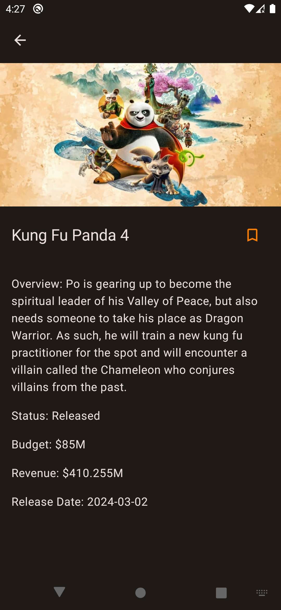
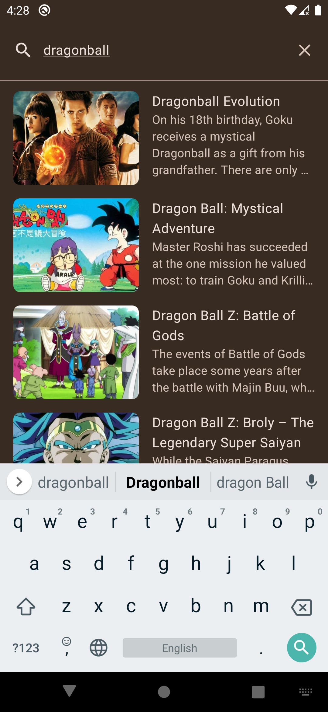
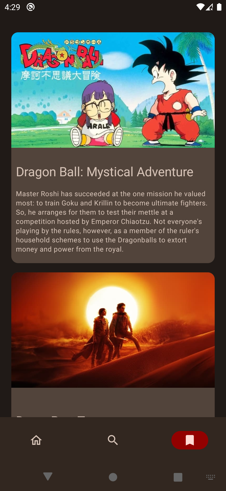

# Welcome to cinema app
this is a basic native android app for browsing the latest movies that uses the **[The Movie Database](https://www.themoviedb.org)** api and is written entirely with **Kotlin** and jetpack **compose**, it implements MVVM architecture and clean code, it showcases and uses most of the android developing basics such as: room, dagger hilt, retrofit, work manager, view models, coroutines,  compose navigation, compose animations and more.

## App navigation
the app consists of three top level screens:

- Home
- Search
- Bookmarks

    

# Building and compiling
for you to be able to build the app you must first include a file in the root project called **local.properties** in which you specify your [TMDB](https://www.themoviedb.org) access token like this:
```gradle
TMDB_ACCESS_TOKEN=yourTmdbAccessToken
```
replace yourTmdbAccessToken with your actual access token